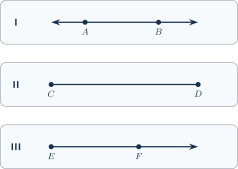
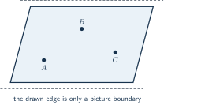
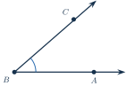
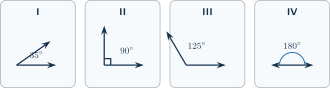
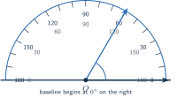
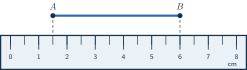
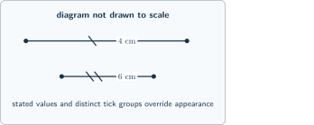
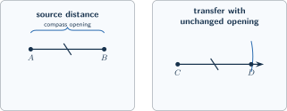
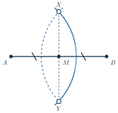

+++
order = 1
subject = "mathematics"
authoring_model = "gpt-5.6-sol"
authoring_reasoning_effort = "high"
curriculum_model = "gpt-5.6-sol"
curriculum_reasoning_effort = "high"
tags = ["geometry", "measurement", "constructions"]
prerequisites = []
provides = [
  "geometric-object-and-notation",
  "segment-and-angle-measure",
  "basic-geometric-construction",
  "geometric-diagram-convention",
]
+++

# Geometric language and measurement

## Points and straight objects

<!-- card-id: f873cbb9-f8d6-4b33-8784-b48635055270 -->
Q: A drawn dot can represent an ideal **point**: one exact location with no length or width. What does the letter beside the dot do?
A: **It names the point.** For example, a dot labeled \(A\) represents point \(A\); the dot's printed size is not the point's mathematical size.

<!-- card-id: 08af8a65-174f-4187-b66d-b5c14c11c09a -->
Q: In a geometry drawing, a straight path that continues without end in both directions is called a **line**.

Which visual feature of panel I shows that it is a line rather than a finite piece?
A: **The arrowhead at each end.** The arrowheads state that the line continues in both directions beyond the part drawn.

<!-- card-id: d6312753-02aa-448e-8550-e404c88b5f81 -->
Q: An **endpoint** is a point where a drawn object stops. A **segment** is the straight part from one endpoint to another, including both endpoints.

In panel II, which points are the endpoints?
A: **\(C\) and \(D\).** The solid endpoint dots show where the segment begins and ends.

<!-- card-id: 6f521b4a-9e34-40b3-b2b7-b18b0ca58ddd -->
Q: A **ray** starts at one endpoint and continues without end in one direction.

In panel III, where does the ray start and in which labeled point's direction does it continue?
A: **It starts at \(E\) and continues through \(F\).** The solid dot marks the endpoint; the single arrowhead marks the continuing direction.

<!-- card-id: 5ec34bd2-1212-4947-accf-2c7b959f6060 -->
Q: The three panels use solid dots for endpoints and arrowheads for continuation.

Which panel represents an object with a fixed beginning and a fixed end, and what evidence decides this?
A: **Panel II.** It has two endpoints and no continuation arrowhead, so it is a segment.

<!-- card-id: 9733d070-5d86-4161-a567-6c540b4a29ad -->
Q: Geometry notation copies the ending information: \(\overline{CD}\) has no arrow above the letters, while \(\overleftrightarrow{AB}\) has arrows in both directions. What objects do these two symbols name?
A: **\(\overline{CD}\) names segment \(CD\), and \(\overleftrightarrow{AB}\) names line \(AB\).** The symbols above the letters match the objects' endings.

<!-- card-id: bf934b35-8856-4172-828e-cd1617aaf47b -->
Q: Ray notation lists the endpoint first: \(\overrightarrow{EF}\) starts at \(E\) and passes through \(F\). Why does \(\overrightarrow{FE}\) name a different ray?
A: **Its endpoint is \(F\), not \(E\).** Reversing the letters reverses which point is the start, so ray notation is order-dependent.

<!-- card-id: 2453c1b1-f2b5-4fd3-ad49-2e23e952773a -->
Q: A **plane** is a flat surface that continues without end in every direction along that surface.

Why do the four drawn edges not make the mathematical plane finite?
A: **They bound only the picture, not the plane.** A page can show just a finite patch of an unbounded flat surface.

<!-- card-id: 563a0d35-ad24-435f-b8fa-2a29459427c1 -->
Q: Points that lie on one line are called **collinear**. If points \(R\), \(S\), and \(T\) all lie on \(\overleftrightarrow{RT}\), what one word describes the three points?
A: **Collinear.** All three points lie on the same line.

<!-- card-id: 08a5f200-5cd4-4b75-b4bf-c2b5c16b6f35 -->
Q: An **intersection** is the point or set of points shared by geometric objects. If two lines meet only at point \(J\), what is \(J\)?
A: **Their intersection point.** It is the one point belonging to both lines.

## Angles and angle notation

<!-- card-id: 41b16040-1e51-46a7-a190-cdf48bb4cc87 -->
Q: An **angle** is formed by two rays with a common endpoint. The rays are its sides, and the common endpoint is its vertex.

Which labeled point is the vertex?
A: **\(B\).** Both rays start at \(B\), so \(B\) is their common endpoint.

<!-- card-id: c41e695f-e00b-41cd-bd19-698c22913e2f -->
Q: A three-letter angle name places the vertex letter in the middle. Give one correct three-letter name for the angle whose sides pass from \(B\) through \(A\) and from \(B\) through \(C\).
A: **\(\angle ABC\)** or **\(\angle CBA\)**. Both names put the vertex \(B\) in the middle.

<!-- card-id: a0262c87-a28b-4c0b-9f2c-8294ac138791 -->
Q: \(\angle ABC\) names an angle object; \(m\angle ABC\) names the numerical measure of that angle. Which notation belongs in an equation whose other side is \(42^\circ\)?
A: **\(m\angle ABC\).** A number measured in degrees equals an angle measure, not the angle object itself.

<!-- card-id: a510405d-9b90-47a7-b78e-d9aa2c4a3ab5 -->
Q: A full turn is divided into \(360\) equal angle units called **degrees**. What fraction of a full turn is \(1^\circ\)?
A: **\(\frac{1}{360}\) of a full turn.** The small raised circle is the degree symbol.

<!-- card-id: a0c5d131-9391-4fa3-ad9a-6f7adee70c29 -->
Q: A **right angle** measures exactly \(90^\circ\), while a **straight angle** measures exactly \(180^\circ\).

How should the angle in panel II be classified?
A: **Right angle.** Its stated measure is exactly \(90^\circ\).

<!-- card-id: 8b84a176-1ec1-46e2-8fe5-c37a4863622b -->
Q: An angle greater than \(0^\circ\) but less than \(90^\circ\) is **acute**; one greater than \(90^\circ\) but less than \(180^\circ\) is **obtuse**.

How should panel III be classified?
A: **Obtuse.** Its \(125^\circ\) measure lies between \(90^\circ\) and \(180^\circ\).

<!-- card-id: 3d0e1f21-b396-496a-85a0-889d135985bb -->
Q: 

Which classification fits panel IV: acute, right, obtuse, or straight?
A: **Straight.** Its sides point away from the vertex along the same line, and its measure is \(180^\circ\).

## Reading measurement instruments

<!-- card-id: d186d230-8226-4d6d-a689-0989dda4312e -->
Q: A **protractor** is a scale for measuring an angle. Place its center mark on the angle's vertex and one angle side along its **baseline**, the straight \(0^\circ\)-to-\(180^\circ\) edge. What error occurs if the center mark is not on the vertex?
A: **The scale no longer measures the angle from its true vertex.** The resulting reading is not the angle's measure.

<!-- card-id: afc0337c-2d1a-400a-a4df-82e115eef287 -->
Q: A typical \(180^\circ\) protractor prints two opposite scales. Follow the scale whose \(0^\circ\) lies on the angle side used as the baseline.

Which printed scale should be followed here?
A: **The scale that begins at \(0^\circ\) on the right.** The baseline side points right, so the reading must grow from that zero.

<!-- card-id: aef59442-8f92-4091-86ec-2f31e68b4948 -->
P: The protractor is centered at \(O\), and the baseline side begins at \(0^\circ\) on the right. What is the measured angle?

S: **IDENTIFY**

This is a protractor-scale reading with two printed scales.

**PLAN**

Follow the scale that starts at \(0^\circ\) on the baseline side, then read where the other side crosses.

**EXECUTE**

**The measured angle is \(60^\circ\).** The right-origin scale reaches \(60^\circ\) at the second side.

**EVALUATE**

The angle is visibly less than a right angle, so the alternative \(120^\circ\) reading is not reasonable.

<!-- card-id: f4b892dc-1757-4bb9-9345-eeb10179aa1d -->
P: A segment's endpoints align with \(1.5\ \mathrm{cm}\) and \(6.0\ \mathrm{cm}\) on a ruler. What is the segment's length?

S: **IDENTIFY**

This is a segment measured from two ruler readings; neither endpoint is at zero.

**PLAN**

Subtract the smaller endpoint reading from the larger endpoint reading.

**EXECUTE**

**The segment is \(4.5\ \mathrm{cm}\) long.** Compute \(6.0-1.5=4.5\).

**EVALUATE**

Adding the length back to the first reading gives \(1.5+4.5=6.0\ \mathrm{cm}\), the second endpoint reading.

## What a diagram claims

<!-- card-id: 7d51f714-2ede-4766-801b-d1fbd6d6e662 -->
Q: A value obtained by reading a ruler or protractor is limited by the instrument's markings, while a value explicitly stated in a problem is treated as exact unless the problem says it was measured. How should a ruler reading of \(4.5\ \mathrm{cm}\) be described?
A: **As a measured value at the ruler's available precision.** It should not be claimed more precisely than the scale supports.

<!-- card-id: eab7ca62-cb39-4c87-ad4e-c84ab73912b9 -->
Q: A **diagram convention** is an agreed mark with a fixed meaning. Short matching tick marks drawn across segments are one such convention. What do the same number and style of tick marks claim?
A: **The marked segments have equal lengths.** A segment with a different tick pattern is not included in that equality claim.

<!-- card-id: 2a045052-1a70-47cc-af19-075a90b3bf1a -->
Q: Matching curved marks drawn inside angles are a diagram convention. What do matching curved marks claim?
A: **The marked angles have equal measures.** The claim comes from the matching marks, not from how wide the angles happen to look.

<!-- card-id: fad577a0-470d-499e-8998-0e929fcc3120 -->
Q: A small square drawn at an angle's vertex is a diagram convention. What numerical measure does it state?
A: **\(90^\circ\).** The square-corner mark states that the angle is right even if the drawing is imperfect.

<!-- card-id: c22f64a9-f924-49b9-a469-88ea4b793c44 -->
Q: The following sketch is explicitly not drawn to scale.

Which segment is mathematically longer, and what evidence controls the decision?
A: **The segment labeled \(6\ \mathrm{cm}\).** The explicit value controls; the one-tick and two-tick patterns are different, so they do not claim the segments are equal.

## Tool roles and constructions

<!-- card-id: cde5d830-4c17-4bea-ad28-605a9a858020 -->
Q: A ruler has a numbered scale, while an **unmarked straightedge** supplies only a straight edge. Which tool is appropriate when the task is to draw a straight path through two given points without measuring a length?
A: **The unmarked straightedge.** The task needs alignment, not a numerical distance.

<!-- card-id: fb08bade-9007-40e4-b048-3a84a92559bf -->
Q: A **compass** keeps the distance between its sharp point and pencil point fixed while it moves. What operation can it perform that an unmarked straightedge cannot?
A: **Transfer a fixed distance.** It can reproduce a distance elsewhere without reporting that distance as a number.

<!-- card-id: 82d67767-541b-4e30-828b-19fb3fa6b5bd -->
Q: You must reproduce a given segment's length on a ray without reading any number. Which tools should you choose, and what distinct job does each perform?
A: **Use a compass to transfer the distance and an unmarked straightedge to draw the ray.** The compass preserves the opening; the straightedge supplies straight alignment.

<!-- card-id: b252c6e4-19ca-4a77-a0ef-ddd030059a70 -->
Q: A geometric **construction** uses agreed tool operations to create an intended exact relationship in the ideal diagram; a physical drawing still has limited precision.

What operation makes the intended length \(CD\) match \(AB\) without using ruler numbers?
A: **The unchanged compass opening is transferred from \(C\) to locate \(D\).** The same opening represents the same distance in both places.

<!-- card-id: 2b7fe3bf-fab0-4343-9ebc-5d1624e230e2 -->
P: A compass is opened from \(A\) to \(B\), then—without changing that opening—is centered at \(C\) to mark point \(D\) on a ray. What relationship has the construction produced, and why?

S: **IDENTIFY**

This is a segment-copy construction, so the key information is the fixed compass opening.

**PLAN**

Track the distance held by the compass from the source segment to the target ray.

**EXECUTE**

**The construction produces \(CD=AB\).** The opening first equals \(AB\), and the same unchanged opening locates \(D\) at that distance from \(C\).

**EVALUATE**

Returning the compass to the two segments would span both endpoint pairs without changing the opening; the matching tick marks record the same equality.

<!-- card-id: a5165d61-b67d-4ee3-942f-95ea342d5c8a -->
Q: A **midpoint** of a segment is a point on the segment that divides it into two equal lengths. If \(M\) is the midpoint of \(\overline{AB}\), what length relationship must hold?
A: **\(AM=MB\).** Being on \(\overline{AB}\) and making those two lengths equal are both part of the midpoint meaning.

<!-- card-id: 11e21657-9b77-44ef-b863-98bd0dfb5dc0 -->
Q: In the construction shown, the compass keeps one opening while centered at \(A\) and at \(B\). Its curved marks meet at \(X\) and \(Y\); the straight line through \(X\) and \(Y\) crosses \(\overline{AB}\) at \(M\).

What relationship at \(M\) is the construction designed to create?
A: **\(AM=MB\), so \(M\) is the midpoint of \(\overline{AB}\).** This is the standard equal-distance midpoint construction; the matching ticks record the equal lengths.

<!-- card-id: f01f837d-139d-457d-bc83-0ebe41848d44 -->
P: Given segment \(\overline{JK}\), describe how to construct its midpoint using only a compass and an unmarked straightedge. Include a genuine check of the result.
S: **IDENTIFY**

This is a midpoint construction using fixed-distance marks and straight alignment.

**PLAN**

Use the same compass opening from \(J\) and \(K\) to make two meeting points, then use the straightedge through those points.

**EXECUTE**

**The midpoint is where \(\overline{JK}\) meets the line through the two compass-mark meetings.** Open the compass to more than half of \(JK\); without changing it, make marks above and below the segment from \(J\), repeat from \(K\), draw through the two meetings, and mark its crossing with \(\overline{JK}\).

**EVALUATE**

Set the compass opening from the crossing to \(J\), then compare it with the distance from the crossing to \(K\); the same opening should span both within the drawing's precision.
