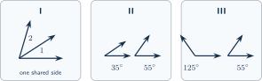
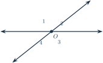
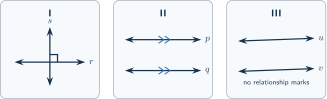
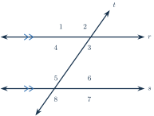
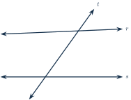
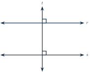

+++
order = 2
subject = "mathematics"
authoring_provider = "openai"
authoring_model = "gpt-5.6-sol"
authoring_reasoning_effort = "high"
authoring_run_id = "request-23"
curriculum_provider = "openai"
curriculum_model = "gpt-5.6-sol"
curriculum_reasoning_effort = "high"
curriculum_run_id = "request-10"
tags = ["geometry", "angles", "parallel-lines", "reasoning"]
prerequisites = ["chapter:01_geometric_language_and_measurement"]
provides = [
  "angle-relationship",
  "parallel-and-perpendicular-lines",
  "transversal-angle-relationship",
  "short-geometric-argument",
]
+++

# Angle relationships and parallel lines

## Angle pairs at one vertex

<!-- card-id: 61fdc768-44c7-418f-abe1-1de2b9432327 -->
Q: Two angles are **adjacent** when they have the same vertex, share one side, and their angle regions do not overlap. A numeral printed inside an angle region can serve as that angle's short name.

Which panel shows adjacent angles, and what visual evidence decides this?
A: **Panel I.** Angles \(1\) and \(2\) share a vertex and one side, and their regions lie on opposite sides of that shared side.

<!-- card-id: b78a1a7e-b065-49d4-b143-263e0922c135 -->
Q: Two angles are **complementary** when their measures total \(90^\circ\); they do not need to touch.

Why are the two angles in panel II complementary?
A: **Their measures total \(90^\circ\).** Compute \(35^\circ+55^\circ=90^\circ\); their separation does not matter.

<!-- card-id: 0c0ea388-87d0-4897-8133-b36b801ad730 -->
Q: Two angles are **supplementary** when their measures total \(180^\circ\); they do not need to touch.

Why are the two angles in panel III supplementary?
A: **Their measures total \(180^\circ\).** Compute \(125^\circ+55^\circ=180^\circ\).

<!-- card-id: b90b44a5-2a71-4327-a608-fec853243d2a -->
Q: Two angles share a vertex and one side. Does that information alone make them complementary? State the decisive test.
A: **No.** Sharing a vertex and side makes the angles adjacent; they are complementary only if their measures total \(90^\circ\).

<!-- card-id: e0fb2dde-6775-4f06-a147-2c672d868cb2 -->
Q: Two rays are **opposite rays** when they share an endpoint and continue in opposite directions along one line. What angle measure do opposite rays form?
A: **\(180^\circ\).** Together they form a straight angle.

<!-- card-id: b060df2a-ec56-4b7a-a2b1-9513178aa68f -->
Q: A **linear pair** consists of adjacent angles whose nonshared sides are opposite rays.

Which one of \(\angle 2\) or \(\angle 3\) forms a linear pair with \(\angle 1\), and what follows about their measures?
A: **\(\angle 2\) forms the linear pair, so their measures total \(180^\circ\).** The angles are adjacent, and their nonshared sides form a line.

<!-- card-id: 02939ee5-03f4-484a-96c5-b22820d07633 -->
Q: **Vertical angles** are the opposite, nonadjacent angle regions made by two intersecting lines.

Which numbered angle is vertical to \(\angle 1\)?
A: **\(\angle 3\).** It lies opposite \(\angle 1\) across the intersection.

<!-- card-id: ade972b2-13aa-4588-b871-85e6d373bb9d -->
Q: Why do vertical angles have equal measures? Use their relationship to one shared adjacent angle.
A: **Each vertical angle is what remains after the same adjacent angle is removed from a \(180^\circ\) straight angle.** Equal straight totals minus the same angle leave equal measures.

<!-- card-id: 95eb21f7-a671-458f-911c-0039e771d38a -->
P: In the intersecting-lines diagram, \(m\angle 2=137^\circ\). Find \(m\angle 1\) and name the angle relationship that determines it.

S: **IDENTIFY**

\(\angle 1\) and \(\angle 2\) form a linear pair.

**PLAN**

Subtract the known measure from the \(180^\circ\) total of a linear pair.

**EXECUTE**

**\(m\angle 1=43^\circ\).** Compute \(180^\circ-137^\circ=43^\circ\).

**EVALUATE**

The measures check because \(43^\circ+137^\circ=180^\circ\), the measure of their straight angle.

## Perpendicular and parallel lines

<!-- card-id: a6286eae-80f4-45ce-92a9-ca6d79117ea6 -->
Q: Lines are **perpendicular** when they intersect to form a right angle. The symbol \(\perp\) means “is perpendicular to,” and a lowercase letter beside a line can name that line.

What relationship does panel I state between lines \(r\) and \(s\)?
A: **\(r\perp s\).** The square-corner mark states that their intersection contains a \(90^\circ\) angle.

<!-- card-id: b5cfb198-4976-4018-bd9a-65eed4d1c1f3 -->
Q: If two lines are perpendicular, why are all four angles at their intersection right angles even when only one square-corner mark is drawn?
A: **The vertical angle to the marked \(90^\circ\) angle is also \(90^\circ\), and each adjacent angle is its \(90^\circ\) supplement.** Thus all four measures are \(90^\circ\).

<!-- card-id: fff7cb6f-16ea-42fe-a104-f0159cd38f08 -->
Q: Two lines in the same plane are **parallel** when they never intersect. The symbol \(\parallel\) means “is parallel to,” and matching small marks on two line bodies state this relationship.

Write the relationship stated in panel II.
A: **\(p\parallel q\).** The lines carry matching parallel marks.

<!-- card-id: b4d61404-966f-42d3-98f5-b6f574fad5b5 -->
Q: In panel II, which marks state that \(p\parallel q\): the arrowheads at the line ends or the matching small marks on the line bodies?

A: **The matching small marks on the line bodies.** The end arrowheads only show that each line continues in both directions.

<!-- card-id: 725869d3-24cc-4cbe-bea4-d0d304963aea -->
Q: Panel III shows two lines that look nearly parallel but have no relationship marks or stated condition.

Can their appearance alone establish that \(u\parallel v\)?
A: **No.** A drawing's appearance is not a geometric claim; parallelism must be stated, marked, constructed, or established by a valid relationship.

<!-- card-id: 656c9a13-5ae8-4ddb-b664-497d00ff62ea -->
Q: What decisive feature distinguishes perpendicular lines from parallel lines in one plane?
A: **Perpendicular lines intersect at a right angle; parallel lines do not intersect.** The symbols are \(\perp\) and \(\parallel\), respectively.

## A transversal and its angle families

<!-- card-id: 95f0ca4f-3e11-4a79-baf5-b6d2922a23f3 -->
Q: A **transversal** is a line that intersects two or more lines at different points.

Why is \(t\) a transversal of \(r\) and \(s\)?
A: **It intersects \(r\) and \(s\) at two different points.** Those two intersections create the eight numbered angle regions.

<!-- card-id: bc55aa4a-eeb5-409e-8b35-01f915c9c519 -->
Q: For two lines cut by a transversal, the angle regions between the two lines are **interior**; those outside are **exterior**.

Is \(\angle 3\) interior or exterior?
A: **Interior.** It lies in the region between \(r\) and \(s\).

<!-- card-id: 2b58054d-e00a-440b-ac1e-ef0a2dbbee62 -->
Q: **Corresponding angles** occupy the same relative corner at the two intersections made by a transversal.

Which angle corresponds to \(\angle 2\)?
A: **\(\angle 6\).** Both occupy the upper-right corner of their intersections.

<!-- card-id: 28ea426c-c386-42f6-b4c5-e8a9ba5ad88d -->
Q: **Alternate interior angles** lie between the two lines and on opposite sides of the transversal.

Which angle is alternate interior to \(\angle 3\)?
A: **\(\angle 5\).** Both are interior, and they lie on opposite sides of \(t\).

<!-- card-id: 9543f29b-78e0-47b9-a830-a3c7b3d0dc31 -->
Q: **Alternate exterior angles** lie outside the two lines and on opposite sides of the transversal.

Which angle is alternate exterior to \(\angle 1\)?
A: **\(\angle 7\).** Both are exterior, and they lie on opposite sides of \(t\).

<!-- card-id: cae65056-084e-4f56-876e-b87b77e0eafa -->
Q: **Same-side interior angles** lie between the two lines and on the same side of the transversal.

Which angle is same-side interior with \(\angle 3\)?
A: **\(\angle 6\).** Both are interior and lie on the same side of \(t\).

<!-- card-id: 11ceccba-d469-44b0-aa14-16ad8099f7de -->
Q: When a transversal crosses parallel lines, corresponding angles, alternate interior angles, and alternate exterior angles have equal measures.

Which angle-family result gives \(m\angle 3=m\angle 5\)?
A: **The alternate-interior-angle result.** The angles are interior and on opposite sides of \(t\), and the parallel marks supply the required condition \(r\parallel s\).

<!-- card-id: 22212e36-684c-4828-a44f-36a9ecb495c5 -->
Q: When a transversal crosses parallel lines, same-side interior angles are supplementary.

What total must \(m\angle 3+m\angle 6\) have?
A: **\(180^\circ\).** The angles are same-side interior angles for the marked parallel lines.

<!-- card-id: d71aa177-2784-427b-866a-fb3cae8f877a -->
Q: A transversal crosses two lines, but the lines are neither stated nor marked parallel. May you conclude that corresponding angles at the two intersections have equal measures? What relationship remains usable at either single intersection?
A: **No; corresponding-angle equality needs parallel lines.** Vertical-angle equality remains usable at either intersection because it depends only on the two lines intersecting there.

## Missing measures and short arguments

<!-- card-id: 83ebb651-c754-4a92-8fd3-798f79c493c6 -->
P: In the marked diagram, \(r\parallel s\) and \(m\angle 2=68^\circ\). Find \(m\angle 6\) and name the determining relationship.

S: **IDENTIFY**

\(\angle 2\) and \(\angle 6\) are corresponding angles formed by a transversal across parallel lines.

**PLAN**

Use the equal-measure result for corresponding angles.

**EXECUTE**

**\(m\angle 6=68^\circ\).** Corresponding angles have equal measures because \(r\parallel s\).

**EVALUATE**

An independent chain agrees: \(\angle 2\)'s linear-pair angle measures \(112^\circ\), its alternate interior angle also measures \(112^\circ\), and the supplement at the lower intersection is \(68^\circ\).

<!-- card-id: 09310030-c5e9-495f-a19c-c64e815c94dd -->
P: In the marked diagram, \(r\parallel s\) and \(m\angle 1=128^\circ\). Find \(m\angle 6\) using two named angle relationships.

S: **IDENTIFY**

The known angle and target are linked by alternate exterior angles and a linear pair at the lower intersection.

**PLAN**

First transfer \(m\angle 1\) to its alternate exterior angle \(\angle 7\); then use the linear pair \(\angle 6\) and \(\angle 7\).

**EXECUTE**

**\(m\angle 6=52^\circ\).** Alternate exterior angles give \(m\angle 7=m\angle 1=128^\circ\) because \(r\parallel s\); the linear pair then gives \(m\angle 6=180^\circ-128^\circ=52^\circ\).

**EVALUATE**

An independent chain agrees: vertical angles give \(m\angle 3=128^\circ\), and same-side interior angles \(\angle 3\) and \(\angle 6\) must total \(180^\circ\), leaving \(52^\circ\).

<!-- card-id: 0c9cf9ca-6ed3-455d-bbf8-ee1de1c22c3c -->
Q: A learner looks at the unmarked diagram and claims, “The two lines look parallel, so corresponding angles must have equal measures.”

What is missing from the learner's reason?
A: **Evidence that the two lines are parallel.** Appearance alone cannot supply the condition needed for corresponding-angle equality.

<!-- card-id: 6e965c68-e5c4-4fae-a2b8-4000de32875a -->
P: A reverse angle test says: if a transversal makes a pair of corresponding angles with equal measures, then the two crossed lines are parallel. In an unmarked diagram, one corresponding pair both measure \(74^\circ\). What can you conclude?
S: **IDENTIFY**

This is a reverse corresponding-angle test for parallel lines.

**PLAN**

Check that the equal angles are corresponding, then apply the stated reverse test.

**EXECUTE**

**The two crossed lines are parallel.** Their corresponding angles have equal measures, so the reverse test applies.

**EVALUATE**

The conclusion would not follow from two equal angles in arbitrary positions; the corresponding placement is essential.

<!-- card-id: 53ae7d60-2a52-43c0-90fd-4cc4a6ad02a0 -->
Q: A short geometric argument links a conclusion to stated or marked facts and names a reason for each link. If \(r\perp t\) and \(s\perp t\), what equal corresponding-angle fact prepares the conclusion \(r\parallel s\)?
A: **The corresponding angles formed with \(t\) are both \(90^\circ\), so they have equal measures.** The reverse corresponding-angle test can then establish \(r\parallel s\).

<!-- card-id: 0b188993-1e19-4749-8907-d014996fce03 -->
P: The square marks state \(r\perp t\) and \(s\perp t\). Give a short reason-conclusion chain establishing the relationship between \(r\) and \(s\).

S: **IDENTIFY**

Line \(t\) is a transversal, and the two marked angles occupy corresponding positions.

**PLAN**

Use perpendicularity to determine both corresponding measures, then apply the reverse corresponding-angle test.

**EXECUTE**

**\(r\parallel s\).** Because \(r\perp t\) and \(s\perp t\), the marked corresponding angles each measure \(90^\circ\); equal corresponding angles establish that the crossed lines are parallel.

**EVALUATE**

Both square marks are necessary evidence: without either one, the equality of the corresponding angles would not be established.
